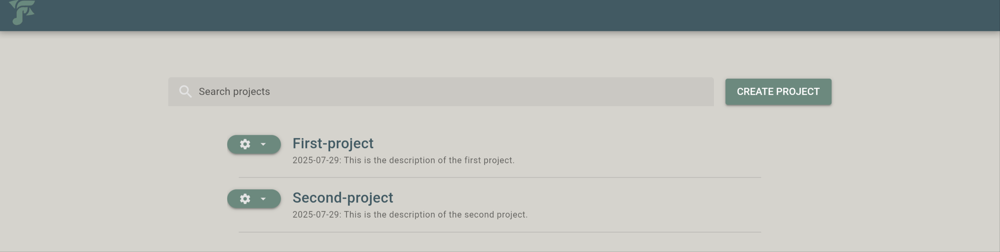

.. |br| raw:: html

    

Selecting and creating projects
===============================

Select and load project
-----------------------

After going to ``http://127.0.0.1:5000`` the user can select from a list a previously created project to load.

|br|

Create new project
------------------

Pressing the button "**CREATE PROJECT**" a dialog appears for creating a new project. The dialog includes two input fields:

* **Project name**: user needs to specify a unique name for the new project.

.. note::

    *fresfolio* creates a directory in the :ref:`projects directory <Initialize fresfolio>` using the provided name. Thus, whitespaces are not allowed in the project name.

* **Project description**: user needs to provide a description of the new project.

|br|

When creating a new project, *fresfolio* creates the following file structure for the project in the :ref:`projects directory <Initialize fresfolio>`:

.. code-block:: text

    Project-name
    ├── project.db
    └── sections

* ``project.db`` is a SQLite database where *fresfolio* will store the created notebooks, chapters and sections of the project.
* The directory ``sections`` is explained in :ref:`Section anatomy`.

The user can create any directory within the project directory.

