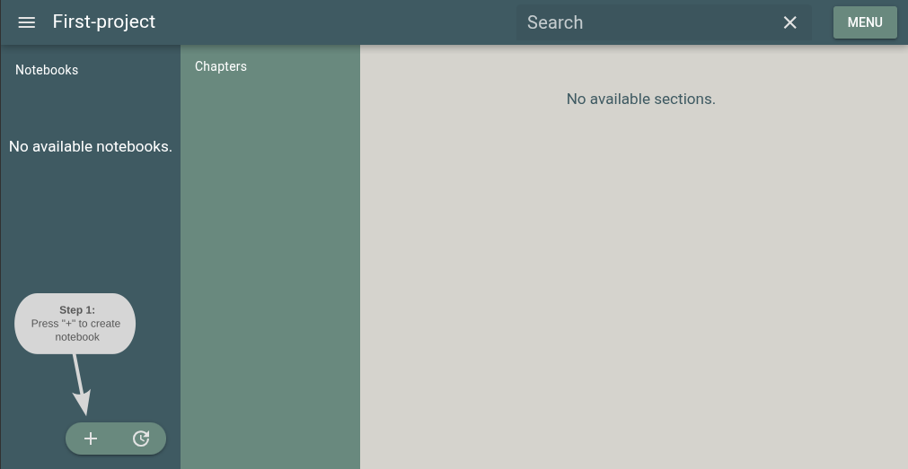
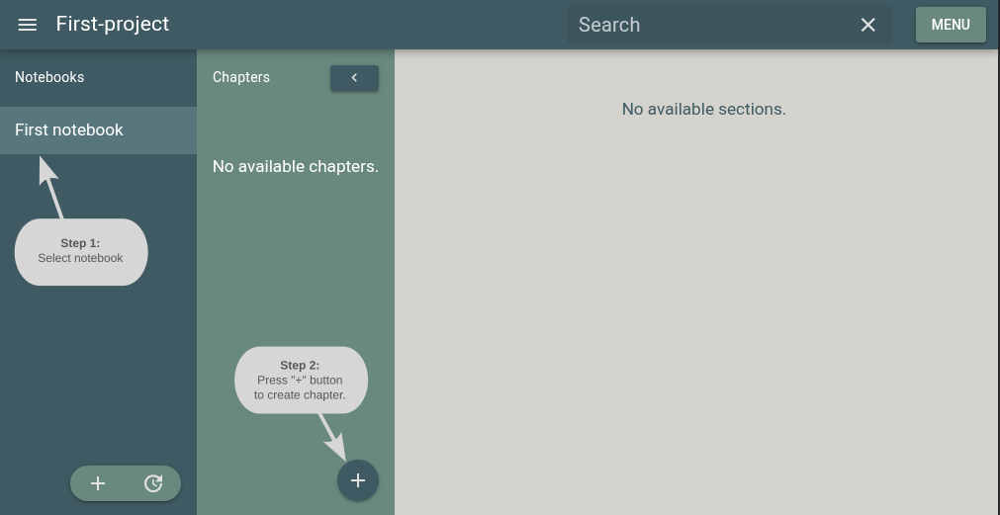

.. |br| raw:: html

    

Create notebooks
==================

After selecting and loading a project, the user can create notebooks for the project.

|br|

Create chapters
=================

To create chapters withing a given notebook, the user should select the corresponding notebook from the "**Notebooks**" column.

|br|
