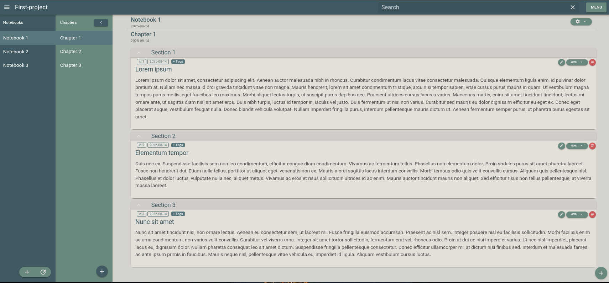

.. |br| raw:: html

    

Welcome to fresfolio documentation!
===================================

.. toctree::
   :maxdepth: 1

   self
   installation
   first_step_after_installation
   start_fresfolio
   create_project
   creating_notebooks_chapters_and_sections
   section_anatomy
   section_content
   omilayers
   omiplots

|br|

.. raw:: html

    

    <i>fresfolio</i> stands for "<b>F</b>or <b>Res</b>earch <b>Folio</b>". It is a browser-based note-taking app designed to help researchers organize and track their projects, datasets, analyses, and results in a structured format. Although the name emphasizes “research", <i>fresfolio</i> is equally suitable for personal use, allowing individuals to manage hobby and student projects, or any collection of work in an organized and interactive way. It provides tools for creating rich documentation making it easier to share findings with collaborators.
    

|br|

The rationale behind *fresfolio* is the following:

* User creates **Projects**.
* Each project has one or more **Notebooks**.
* Each notebook has one or more **Chapters**. 
* Each chapter has one or more **Sections**.

|br|
