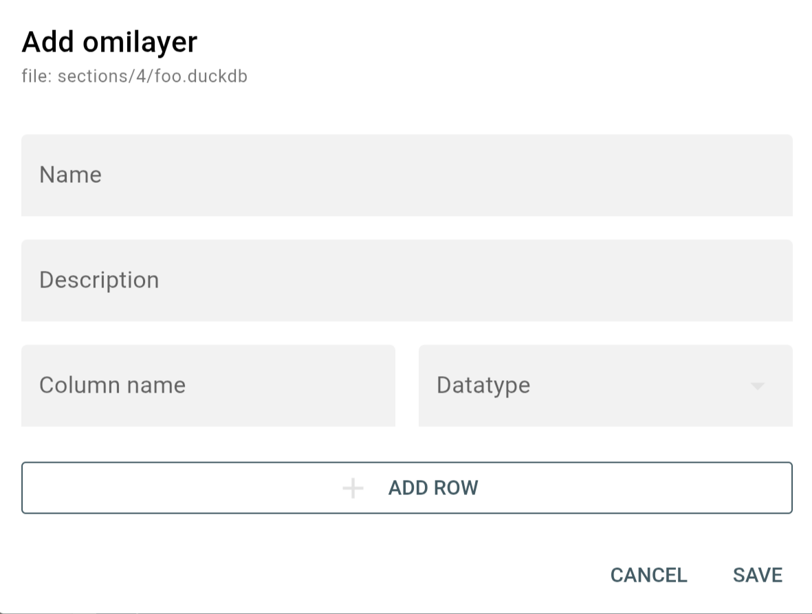

.. |br| raw:: html

    

Omilayers
=========

.. note::

    This section belongs to the extended functionality of *fresfolio* and requires the python package ``omilayers``. Check :ref:`Optional packages` on how to install it.

*omilayers* is a Python packages for data management, where data are stored in tables called layers. Please refer to the `Github repository <https://github.com/dkioroglou/omilayers>`_ of *omilayers* for more information. *fresfolio* uses *omilayers* as a way to create and render stored data in the form of tables. 

Render stored data
------------------

To render stored layers the following syntax should be used:

.. code-block:: latex

    \begin{omitable}
    project: PROJECT
    file: dir1/dir2/foo.db
    \end{omitable}

* ``project``: it refers to the name of an existing project and is optional. If omitted, the current project is considered.
* ``file``: it refers to the path of an existing *omilayers* database. The path should be relative to the root directory of the project.

**HTML rendering**

|br|

Pressing the button "**SELECT LAYER**" a dialog pops-up to select an existing layer to render as table:

|br|

The user needs to select a stored layer and whether all or the top 5 rows will be rendered. 

.. note::

    Avoid rendering very large layers as this will impact the performance of the browser.

.. image:: images/omilayers_rendering_3.png
   :width: 600
   :height: 200
   :alt: omilayers_rendering_3
   :align: center

|br|

The user can also set a layer as the default layer:

.. code-block:: latex

    \begin{omitable}
    project: PROJECT
    file: dir1/dir2/foo.db
    layer: layer1
    nrows: 5
    \end{omitable}

* ``layer``: the name of the stored layer to use as default layer.
* ``nrows``: the number of rows to render from the default layer. To render all rows set ``nrows: all``.

|br|

this way the user has the option to directly render the default layer or select a different layer to render.

Create new layers
-----------------

Pressing the menu button on the top right corner:

|br|

shows a menu with the option "**Create new layer**". Selecting this option a dialog pops-up to create the layer:

|br|

Pressing the button "**ADD ROW**" will add a new row to the form for specifying a new column. Columns can be of datatype "TEXT", "INTEGER" or "FLOAT".

Add data to layer
-----------------

After selecting a layer, two options become available in the menu for adding data to the selected layer:

1. Insert data from form to layer
^^^^^^^^^^^^^^^^^^^^^^^^^^^^^^

Choosing this option a dialog pops-up with as many inputs as the number of the layer's columns.

|br|

2. Insert data from file to layer
^^^^^^^^^^^^^^^^^^^^^^^^^^^^^^^^^

Choosing this option a dialog pops-up to upload data from a file to the selected layer.

|br|

The uploaded file should meet the following requirements:

* first row should be the column names of the layer (order does not matter).
* values should match the datatype of their corresponding columns.

