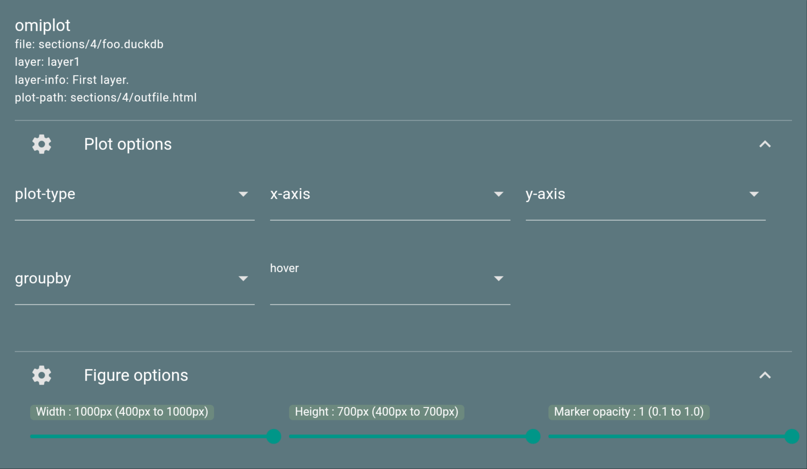

.. |br| raw:: html

    

Omiplots
========

.. note::

    This section belongs to the extended functionality of *fresfolio* and requires the python packages ``omilayers`` and ``bokeh``. Check :ref:`Optional packages` on how to install them.

*fresfolio* uses *bokeh* for creating interactive plots using data stored with *omilayers*.
To create an interactive plot use the following syntax:

.. code-block:: latex

    \begin{omiplot}
    project: PROJECT
    file: sections/4/foo.duckdb
    layer: layer1
    name: NAME
    save-dir: sections/4
    \end{omiplot}

* ``project``: it refers to the name of an existing project and is optional. If omitted, the current project is considered.
* ``file``: it refers to the path of an existing *omilayers* database. The path should be relative to the root directory of the project.
* ``layer``: the name of the layer stored with *omilayers* that holds the data for plotting.
* ``name``: the name of the output file. *bokeh* will store the plot with the extenstion ``.htmk``. Thus, the ``name`` can be set to ``[NAME]`` or to ``[NAME].html``.
* ``save-dir``: the path where the plot will be stored. This path should be relative to the root directory of the project.

**HTML rendering**

|br|

