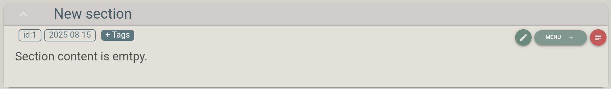

.. |br| raw:: html

    

.. _Section anatomy:

Section anatomy
===============

|br|

Each section is consisted of the following parts:

Section title
-------------

When a section is created the title "*New section*" is given. Clicking on the section title folds and unfolds the section's body.

Section toolbar
---------------

The section's body starts with the toolbar. To the left, the following are visible:

* ``id``: this is a unique number *fresfolio* assigns to each section.
* ``date``: the section's creating date. 
* ``+Tags`` button: pressing this button the user can assign tags (separated with comma) to the section. Tags are useful for grouping sections.

To the right the following are visible:

* 1st button can be used to change section's title.
* 2nd button is a "**Menu**" button with the following options:

  * **Create section directory**: this will create a directory named after the section's ``id`` in the following path:

    .. code-block:: text

        Project-name
        ├── project.db
        └── sections
            └── [id]

  * **Delete section**: deletes the section in ``project.db`` and its directory if it exists.

    Additional options that become available if the section directory is created:

  * **View section directory tree**: when pressed, a dialog pops-up showing the file structure of the section's directory.
  * **Upload files**: when pressed, a dialog pops-up to upload files to the section's directory. Note that this will copy the uploaded file from its location to the section's directory. This option is especially useful for broadcasting.
* 3rd button can be used to edit the section's content.

