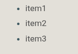
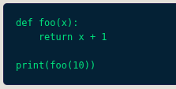
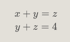
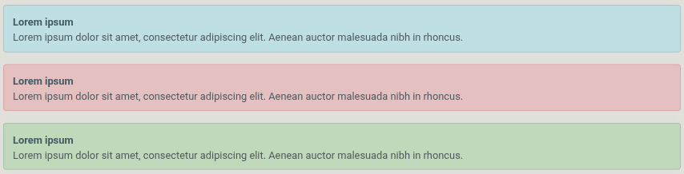
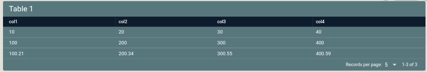
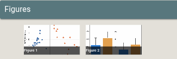
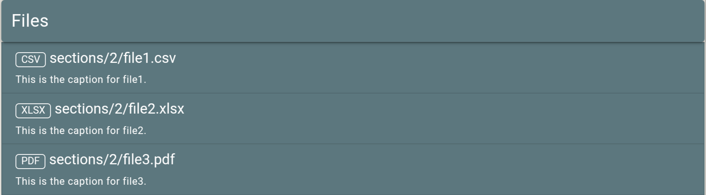
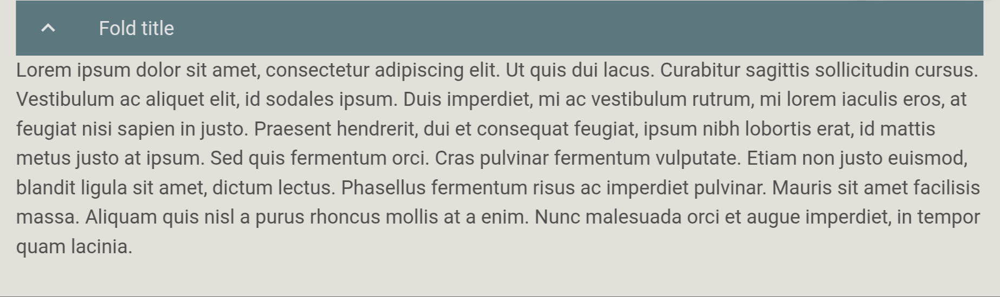

.. raw:: html

   <style> .red {color:red;} </style>
   <style> .green {color:green;} </style>

.. |br| raw:: html

   <br />

.. role:: red

.. role:: green


Section content
===============

The section content is stored in the ``project.db`` as plain text and is converted to HTML for rendering. For typesetting, Markdown and Latex-like syntax can be used.

Inline markup syntax
--------------------

Markdown syntax
~~~~~~~~~~~~~~~

Markdown syntax can be used for following inline typesetting:

===================   ==============
syntax                HTML rendering
===================   ==============
``# TITLE``           Create level 1 "TITLE"
``## TITLE``          Create level 2 "TITLE"
``### TITLE``         Create level 3 "TITLE"
``**TEXT**``          Make "TEXT" bold
``__TEXT__``          Make "TEXT" italic
```CODE```            Write inlince "CODE"
``[NAME](url)``       Create link with "NAME" that directst to "URL"
``$MATH$``            Create inline "MATH" symbols and equations.
===================   ==============

Latex like syntax
~~~~~~~~~~~~~~~~~

Latex like syntax can be used for the following inline typesetting:

===================================   ==============
syntax                                HTML rendering
===================================   ==============
``\text-green{TEXT}``                 Make "TEXT" green
``\text-red{TEXT}``                   Make "TEXT" red
``\button{LABEL, URL}``               Create a button with "LABEL" that directs to "URL"
===================================   ==============

Icons
~~~~~

The following icons are available for inline use:

===================   ==============
syntax                HTML rendering
===================   ==============
``\todo``             |todoicon|
``\done``             |doneicon|
``\info``             |infoicon|
``\error``            |erroricon|
===================   ==============

Multiline markup syntax
-----------------------

Markdown syntax
~~~~~~~~~~~~~~~

The following markdown syntax can be used for multi-line typesetting:

Lists
^^^^^

using asterisks:

.. code-block::

   * item1
   * item2
   * item3

or using dashes:

.. code-block::

   - item1
   - item2
   - item3

**HTML rendering**




Code blocks
^^^^^^^^^^^

.. code-block::

   ```
   def foo(x):
       return x + 1

   print(foo(10))
   ```

**HTML rendering**



Multi-line math
^^^^^^^^^^^^^^^

.. code-block::

   $$
   x + y = z \\
   y + z = 4 
   $$

**HTML rendering**



Latex like syntax
~~~~~~~~~~~~~~~~~

The Latex like syntax for multi-line typesetting has the following general syntax:

.. code-block:: latex

   \begin{markup}[options]
   entry
   \end{markup}

Colored notes
^^^^^^^^^^^^^

.. code-block:: latex

   \begin{note}[blue]
   **Lorem ipsum**
   Lorem ipsum dolor sit amet, consectetur adipiscing elit. Aenean auctor malesuada nibh 
   in rhoncus.
   \end{note}

Colored notes are available with blue, red and green background and the color is passed in the options:

- ``\begin{note}[blue]``
- ``\begin{note}[red]``
- ``\begin{note}[green]``

**HTML rendering**



|br|

Tables
^^^^^^

Create table manually:

.. code-block:: latex

    \begin{table}[title: My title]
    col1, col2, col3, col4
    10, 20, 30, 40
    100,200,300,400
    100.21, 200.34, 300.55, 400.59
    \end{table}

When creating tables manually, the following options can be passed:

* ``title``: if omitted, the table header defaults to the title "**Table [NUMBER]**". If included, for instance ``title: My title``, it gives the possibility to add a custom title to the table "**Table [NUMBER]: My title**". The table number gets incremented based on the number of tables that exist in a given section.

Load table from a file:

.. code-block:: latex

    \begin{table}[project:PROJECT, file:FILE, title: My title]
    \end{table}

When loading tables from file the following options are available:

* ``title``: see above.
* ``project``: it refers to the name of an existing project and is optional. If omitted, the current project is considered.
* ``file``: the file path to load a table from. This path should be an existing file relative to the root directory of the project. For instance, ``file: sections/1/foo.csv``. Wildcards can also be used, example ``file: sections/1/*.csv``. In this case, a table will be created for each file. The delimiter can be comma or tab and is identified from the first line of each file that should contain the names of the table columns.

**HTML rendering**



|br|

Figures
^^^^^^^

Specify figures manually:

.. code-block:: latex

    \begin{figures}[title:My title]
    project: PROJECT
    figure: figure_1.png
    caption: This is the caption of the Figure 1

    project: PROJECT
    figure: figure_2.png
    caption: This is the caption of the Figure 2
    \end{figures}

Figures can have one or more entries. Each entry is consisted of the following fields:

* ``project``: refers to the name of an existing project and is optional. If omitted, the current project is considered.
* ``figure``: should be the path to an existing figure relative to the root directory of the project.
* ``caption``: refers to the caption of the figure and is optional. If omitted, the caption "**Caption not available**" is rendered. 

When creating figures manually, the following options are available:

* ``title``: if omitted, the figures header defaults to the title "**Figures**". If included, for instance ``title: My title``, it gives the possibility to add a custom title to the figures header "**Figures: My title**".

Specify figures using wildcards:

.. code-block:: latex

    \begin{figures}[project:PROJECT, file:FILE, title:My title]
    \end{figures}


When specifying figures using wildcards, the user cannot add captions to each figure and the following options are available:

* ``title``: see above.
* ``project``: refers to the name of an existing project and is optional. If omitted, the current project is considered.
* ``file``: it refers to the path relative to the root directory of the project, example ``file: sections/1/*.jpg``.

Figures are rendered as clickable thumbnails.

**HTML rendering**



Files
^^^^^

Files can have one or more entries. 

.. code-block:: latex

    \begin{files}[title:My title]
    project: PROJECT
    file: sections/2/file1.csv
    caption: This is the caption for file1.

    project: PROJECT
    file: sections/2/file2.xlsx
    caption: This is the caption for file2.

    project: PROJECT
    file: sections/2/file3.pdf
    caption: This is the caption for file3.
    \end{figures}

Each entry is consisted of the following fields:

* ``project``: refers to the name of an existing project and is optional. If omitted, the current project is considered.
* ``file``: should be the path to an existing file relative to the root directory of the project.
* ``caption``: refers to the caption of the figure and is optional. If omitted, the caption "**Caption not available**" is rendered. 

Files can have the following options:

* ``title``: if omitted, the files header defaults to the title "**Files**". If included, for instance ``title: My title``, it gives the possibility to add a custom title to the files header "**Files: My title**".

**HTML rendering**



|br|

When files are clicked, they open with the default program.

Foldable content
^^^^^^^^^^^^^^^^

To create foldable content the following syntax should be used:

.. code-block:: latex

   \begin{fold}[Fold title]
   TEXT
   \end{fold}

**HTML rendering**



|br|
